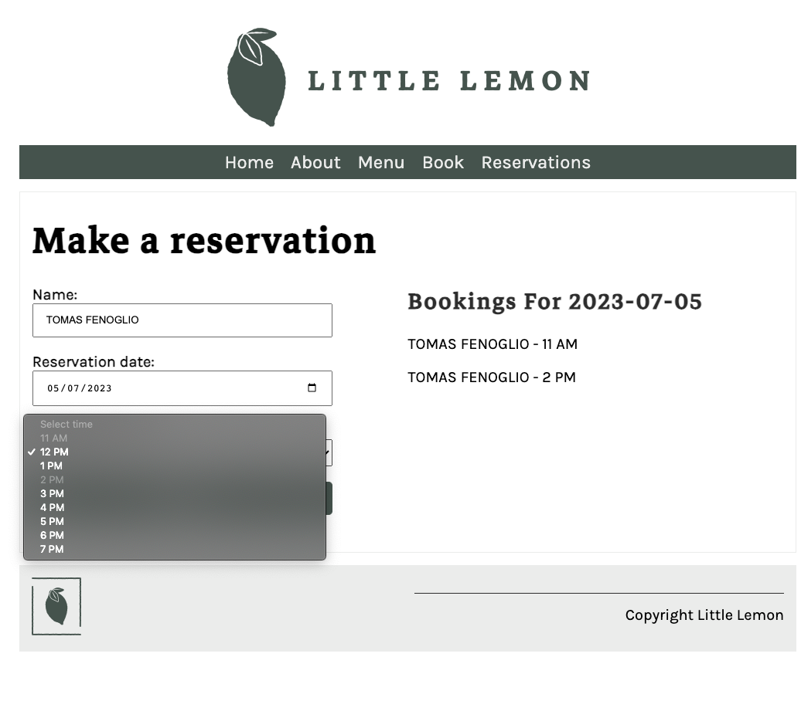
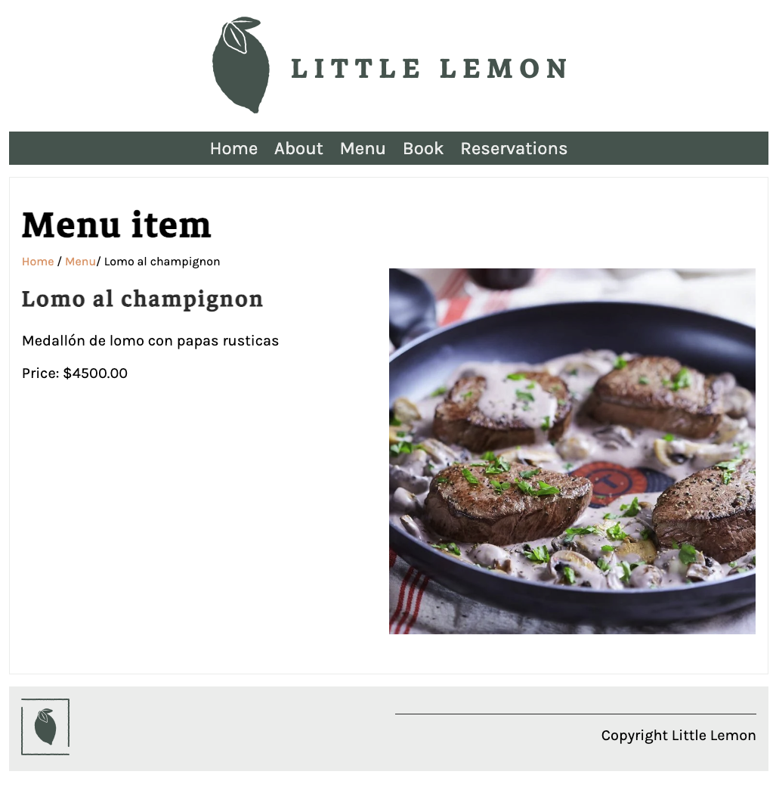
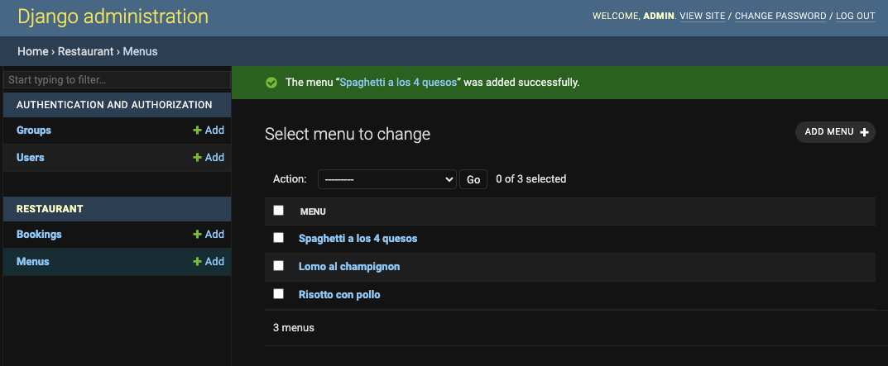

### **Project Info**
- **Project Name:** - Fullstack web application for LittleLemon restaurant.
- **Project Description:** - This was my final project for the "The Full Stack" course of the [Meta Back-End Developer Professional Certificate](https://www.coursera.org/professional-certificates/meta-back-end-developer). Both frontend and backend developed with Django.
- **Project Features:** - Table reservations can be made through the website and are stored in the MySQL database. The page renders and does not allow you to reselect schedules already reserved. The "reservations" tab renders a JSON with all the reservations already made.
The information on menu items is managed through Django admin, since they come from a MySQL table.

### **Technologies Used**
- Django
- MySQL

### **Concepts and knowledge applied in this project**
- GIT version control
- MySQL database implementation
- User authentication
- Security and Testing

### **Installation Instructions**
1. Clone repository on your local
2. Run "pipenv shell" to activate virtual environment
3. Run "pipenv install" to install dependencies
4. Run "python manage.py runserver" to run development server
5. You can log to Django admin through http://127.0.0.1:8000/admin/ (user: admin, password:admin@123!) to manage database. Please, also dont forget to check your MySQL configuration in settings.py.

### **Screenshots**

Thanks, Tom!